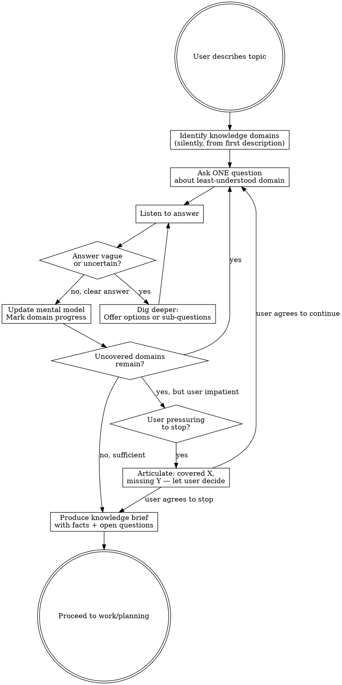

# Pick My Brain

## Overview

A structured questioning technique that builds shared understanding between agent and user before any work begins. The core principle: **never guess what you can ask.**

Without this skill, agents ask good initial questions but collapse under social pressure ("you have enough context"), miss entire knowledge domains, and can't track what they don't know.

## When to Use

- Before a planning session (use this THEN plan)
- Starting any non-trivial task where the user knows more than you
- When you catch yourself about to make an assumption
- When requirements feel vague or incomplete

**Do NOT use for:**
- Simple, well-defined tasks ("fix this typo", "rename this variable")
- Tasks where the user already provided a detailed spec
- Follow-up work where context was already established

## The Iron Rules

1. **One question at a time.** Never bundle. Not even "just two quick ones."
2. **Dig into vague answers.** "Yeah something like that" is not an answer. Probe why.
3. **Track your coverage.** Know what domains you've explored and which remain.
4. **Resist pressure to stop.** When the user says "you have enough context," respond with what you've covered and what's still missing. Let them make an informed choice.
5. **Produce a brief.** Always end with a written knowledge brief before any work begins.

## Questioning Flow



## Domain Discovery

After the user's first message, silently identify relevant knowledge domains. These vary by topic but commonly include:

| Domain | Key Questions |
|--------|--------------|
| **Who** | Users, roles, permissions, stakeholders |
| **What** | Core features, scope, what's in/out |
| **Why** | Goals, success metrics, motivation |
| **How (current)** | Existing systems, tech stack, constraints |
| **How (desired)** | Preferred approach, patterns, tools |
| **Edge cases** | Error states, limits, unusual scenarios |
| **Context** | Timeline, team, dependencies, budget |

Don't announce the domains. Use them as a mental checklist to track what you know and what you don't.

**Adapt to the topic.** For non-technical subjects, replace "tech stack" with "tools/processes," "edge cases" with "exceptions/risks," etc. The framework is domain-agnostic.

**When to stop:** You have sufficient understanding when you can predict how the user would answer the next question in each domain. If you'd be guessing, keep asking.

## Handling Uncertainty

When the user says "I don't know" or gives a vague answer:

1. **Validate** — "That's fine, let's figure it out together"
2. **Offer options** — "Usually this is handled by A, B, or C. Does one of those sound right?"
3. **Reframe** — Ask from a different angle ("What would frustrate your users if it worked this way?")
4. **Name the consequence** — "This decision affects X. Want to explore it now or flag it as open?"

**Never** silently interpret a vague answer as confirmation. If you're not sure what they meant, say so.

## Resisting Pressure to Stop

When the user says "you have enough context" or "let's just start":

**Do NOT** capitulate. Instead:

> "We've covered [domains covered]. I still don't have clarity on [specific domains]. Those will directly affect [concrete consequence]. Can I ask about those, or would you prefer I flag them as assumptions in the plan?"

This gives the user an informed choice rather than letting gaps become hidden assumptions.

**Never** negotiate the number of remaining questions ("just two more, I promise"). You don't know how many you need until you hear the answers.

## Knowledge Brief Template

When questioning is complete, produce this before any work:

```
## Knowledge Brief: [Topic]

### Facts (confirmed by user)
- [Fact 1]
- [Fact 2]
...

### Constraints
- [Technical, business, timeline constraints]

### Decisions Made
- [Decision]: [chosen option] (reason: [why])

### Open Questions (flagged for later)
- [Question 1]: impact on [what]
- [Question 2]: impact on [what]

### Assumptions (need validation)
- [Assumption]: assumed because [reason]

### Out of Scope (not discussed)
- [Topic 1]: noted for future consideration
- [Topic 2]: explicitly deferred
```

Ask the user to confirm or correct the brief before proceeding.

**The out-of-scope section is critical.** It names what you didn't cover, so the user can catch gaps you missed. Silent omissions become hidden risks.

## Red Flags — You're About to Violate This Skill

- Asking 2+ questions in one message
- Rephrasing a vague answer as if it were clear
- Jumping to planning without a brief
- Saying "I think I have enough context"
- Negotiating "just two more questions"
- Making assumptions instead of asking

**All of these mean: slow down. Ask the question.**

## Common Mistakes

| Mistake | Fix |
|---------|-----|
| Dumping a numbered list of questions | Ask ONE. Wait. Ask next based on answer. |
| Treating "I'm not sure" as "skip this" | Offer options. Reframe. Help them figure it out. |
| Caving to "let's just start" | Articulate what's covered and what's missing. |
| Asking only technical questions | Cover who, why, and context too. |
| Producing brief with hidden assumptions | Label every assumption explicitly. |
| Announcing your questioning framework | Just ask naturally. Don't explain the process. |
